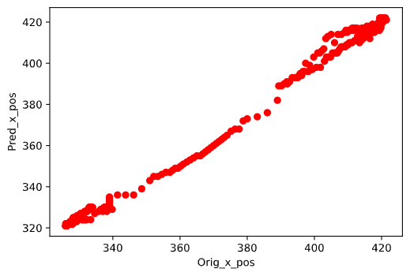
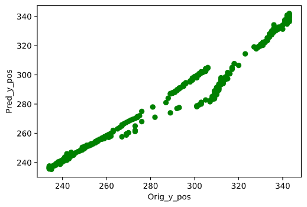
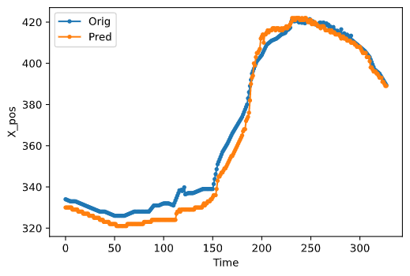
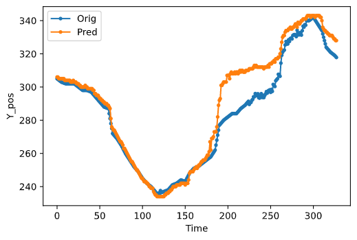

# LPW_pupil_tracking

### Set of Experiments on LPW pupil tracking

Dataset : Labelled Pupils in the Wild (LPW): Pupil detection in unconstrained environments --> [Dataset link](https://www.mpi-inf.mpg.de/departments/computer-vision-and-machine-learning/research/gaze-based-human-computer-interaction/labelled-pupils-in-the-wild-lpw)

This repository contains my CV experiments on the LPW dataset
***
#### Experiment 1
Only using classical CV & IP techniques 

| X_pos Orig vs Pred | Y_pos Orig vs Pred |
|-------------|---------------|
|  |   |
|  |  |

***
#### Reference

1. Marc Tonsen, Xucong Zhang, Yusuke Sugano, Andreas Bulling
Labelled pupils in the wild: A dataset for studying pupil detection in unconstrained environments (Inproceeding) Proc. of the 9th ACM International Symposium on Eye Tracking Research & Applications (ETRA 2016), pp. 139-142, 2016.
doi: 10.1145/2857491.2857520
2. Random

